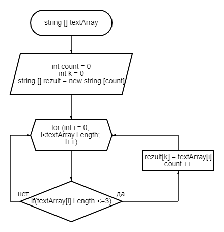

# Задача
## Написать программу, которая из имеющегося массива строк формирует массив из строк, длина которых меньше либо равна 3 символа. Первоначальный массив можно ввести с клавиатуры, либо задать на старте выполнения алгоритма. При решение не рекомендуется пользоваться коллекциями, лучше обойтись исключительно массивами

# Решение

1. Выводим запрос: "Введите количество элементов массива"(n)
2. Просим ввести строчные элементы массива по очереди до n-го, которые записываем в массив строк textArray.
3. В переменную count с поммощью цикла с проверкой длины элементов массива (<=3) записываем количество таких элементов.
4.  Вторым циклом внутри метода mas(textArray) заполняем строчный массив textArray элементами, удовлетворющими условию (до 3-х символов).
5. Выводм полученный массив на экран.

